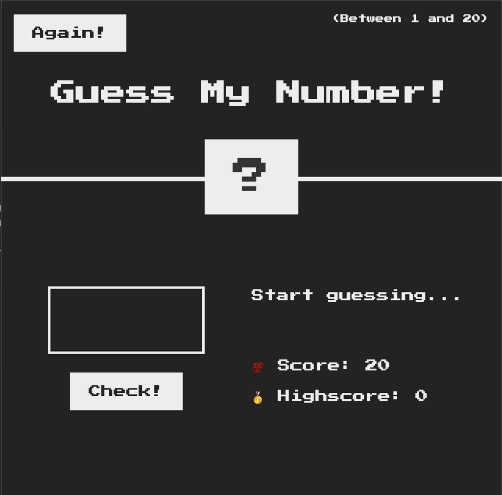

# Guess-My-Number-Game
Welcome to the "Guess a Number" game! This simple and fun game challenges you to guess a number between 1 and 20.

# How to Play
- Guess a Number: Enter a number between 1 and 20 in the input field.
- Check Your Guess: Click the "Check" button to see if your guess is correct. You will see if your number is high or low than the actual number from the message.
- Win the Game: Keep guessing until you correctly guess the number!
- You will loose the game if score reaches to 0. For every wrong guess , you score will drop down by 1.
- Click again to start over.

# Features
- Random Number Generation: The game generates a random number between 1 and 20 for each round.
- User Input: Players can enter their guess using an input field.
- Feedback: The game provides feedback on whether the guess was too high, too low, or correct.
- Score Tracking: The game tracks the number of attempts it takes to guess the correct number.

# Technologies Used
- JavaScript: Used to implement the game logic and interactivity.
- HTML: Used to structure the game interface.
- CSS: Used to style the game interface and make it visually appealing.

# How to Play
You can play the "Guess a Number" game by downloading or cloning the repository and opening the index.html file in your web browser. 

# Screenshots

